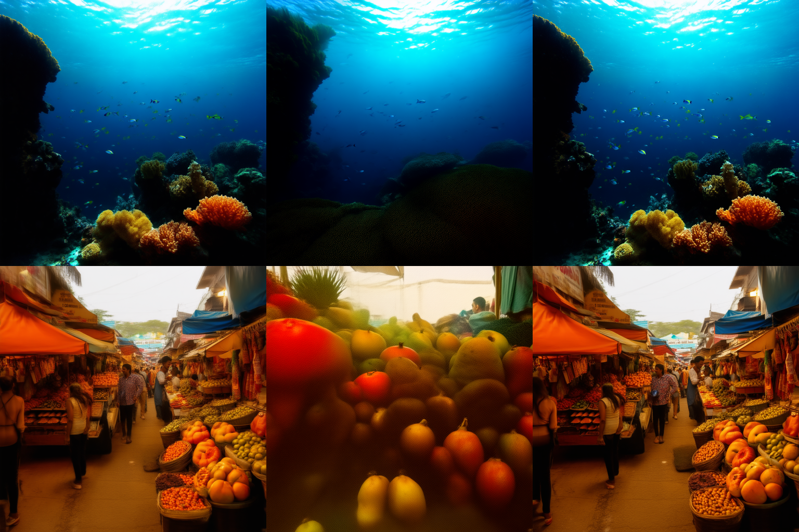

# Accelerating Diffusion Sampling via Exploiting Local Transition Coherence

<p align="center">
  <a href="https://arxiv.org/abs/2503.09675">
    
  </a>
  <a href="https://colab.research.google.com/drive/1h0SM3dp7oUzjBdahmwEcJn9RCq2gryD1">
    
  </a>
</p>

This project aims to introduce a training-free method, LTC-Accel, which accelerates the sampling process of diffusion models by identifying **Local Transition Coherence** and implementing corresponding acceleration strategies. Here we just present an example on EDM based on Stable Diffusion v3.5, and you can feel free to change the base model and scheduler since LTC-Accel is training-free and widely compatiable. The project includes two main components: the original model and scheduler (`main.py`) and the accelerated sampling strategy (`step.py`).

## Table of Contents

- [Quickstart](#quickstart)
- [Introduction](#introduction)
- [Installation](#installation)
- [Usage](#usage)
  - [Running the Original Model](#running-the-original-model)
  - [Running the Accelerated Sampling](#running-the-accelerated-sampling)
- [Visualization](#visualization)
- [Other Implementations and Plugins](#other-implementations-and-plugins)
- [Contributing](#contributing)
- [License](#license)

## Quickstart

Before we dive into the details, we invite you to try our [Quickstart Colab Demo](https://colab.research.google.com/drive/1h0SM3dp7oUzjBdahmwEcJn9RCq2gryD1) to experience LTC's performance firsthand. Like what you see? A star would mean a lot to us!

## Introduction

Diffusion models have shown remarkable performance in text-based generation, but their sampling process can be computationally intensive. This project explores the phenomenon of **Local Transition Coherence** in the sampling process and implements strategies to accelerate the sampling process without compromising the quality of the generated samples.

The project consists of two main files:

- `main.py`: Implements the original diffusion model and scheduler.
- `step.py`: Implements the accelerated sampling strategy.

## Installation

To use this project, clone the repository and install the required dependencies.

```bash
git clone https://github.com/zhushangwen/LTC-Accel.git
cd ./LTC-Accel
```

## Usage
### Running the Original Model
To run the original diffusion model and scheduler, set parameters as the followings:

```python
images = pipe(prompt, device=device, num_inference_steps = inference_steps, cal_wg = False, skip_x = False).images
```

You can feel free to change the parameters as long as `skip_x = False`. Then you can run the original model:
```bash
python main.py
```

### Running the Accelerated Sampling
To run the accelerated sampling process, first it is necessary to obtain one important parameter $w_g$ used for measuring the **Local Transition Coherence** and approximating some sampling steps. Specifically, set `cal_wg = True` and `skip_x = False` as the following example:

```python
images = pipe(prompt, device=device, num_inference_steps = inference_steps, cal_wg = True, skip_x = False).images
```

Then, use the $w_g$ to run the accelerated sampling of the original sampling process:

```python
images = pipe(prompt, device=device, num_inference_steps = inference_steps, cal_wg = False, skip_x = True).images
```
```bash
python main.py
```

You can feel free to modify the parameters concerning the acceleration condition in `step.py` as you want. The following is one example for `mod` and `skip_cond`:
```python
mod = 2
skip_cond = (i % mod == mod - 1 and i > 20)
```

## Visualization
The accelerated sampling strategy implemented in this project has been tested on various datasets and models. Below are some images generated through the original and accelerated sampling:
<div style="position: relative; display: inline-block;">
  
  <!-- 根据实际图片位置调整 top 和 left 的值 -->
  </div>
</div>

Specifically, the first column presents images generated from 8-step LTC-Accel accelerated from the 12-step original sampling process, while the second and the third column are generated from 8-step and 12-step original sampling process.

## Other Implementations and Plugins
We sincerely thank the authors listed below who implemented LTC-Accel in plugins or other contexts.

- Diffusers: https://huggingface.co/docs/diffusers


