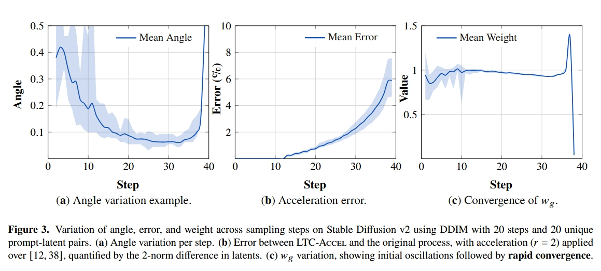

# Accelerating Diffusion Sampling via Exploiting Local Transition Coherence

(Building Now...)

<p align="center">
  <a href="https://arxiv.org/abs/2503.09675">
    
  </a>
  <a href="https://colab.research.google.com/drive/1h0SM3dp7oUzjBdahmwEcJn9RCq2gryD1">
    
  </a>
</p>

<div align="center">
  
  <br>
  <em>
      (Results on Stable Diffusion v3.5. Left: 8-step LTC-Accel accelerated from 12-step original. Middle: 8-step original. Right: 12-step original.) 
  </em>
</div>
<br>

### Why LTC-Accel  
* 🚀 **Instant speed‑ups, zero retraining**: Achieve significant sampling acceleration without touching your model weights
* 🔄 **Architecturally agnostic**: Seamlessly supports any base model and scheduler combination
* ⚡ **True plug‑and‑play**: Drop it into your existing pipeline—no code rewrites, just faster results

### Updates
* **July 10, 2025**: 🧪 [Interactive Colab Demo](https://colab.research.google.com/drive/1h0SM3dp7oUzjBdahmwEcJn9RCq2gryD1) released - experience LTC-Accel in real-time directly from your browser!
* **June 26, 2025**: 🎉 Our paper accepted to **ICCV 2025**!
* **March 10, 2025**: 🚀 Initial release of **LTC-Accel** with Stable Diffusion v3.5 support!

### Instant Demo: Try on Colab

Before we dive into the details, we invite you to try our [Quickstart Colab Demo](https://colab.research.google.com/drive/1h0SM3dp7oUzjBdahmwEcJn9RCq2gryD1) to experience LTC-Accel's performance firsthand. Like what you see? A star would mean a lot to us!

### Introduction
**LTC-Accel** is a **training-free acceleration framework** that enhances sampling efficiency in diffusion models by identifying and leveraging **Local Transition Coherence (LTC)** (shown in the left figure). 
Designed as model-agnostic solution, it integrates seamlessly with diverse pipelines while achieving up to **10× speedup** when combined with distillation techniques.

<div align="center">

</div>

<div align="center">

<br>
<em>
  (A concise illustration of the LTC‑Accel procedure.)
</em>
</div>

## Quick Start

### Installation

```bash
pip install -r requirements.txt
```

### Usage

```python
import torch
from diffusers import FlowMatchEulerDiscreteScheduler
from step import StableDiffusion3Pipeline  

torch.cuda.empty_cache()
def run_inference(device, model_id, inference_steps):
    torch.cuda.empty_cache()
    prompt = "A pretty girl with anime style"
    scheduler = FlowMatchEulerDiscreteScheduler.from_pretrained(model_id, subfolder="scheduler")
    pipe = StableDiffusion3Pipeline.from_pretrained(
        model_id,
        torch_dtype=torch.bfloat16, 
    )
    pipe = pipe.to(device)
    pipe.scheduler = scheduler

    # Generate origrinal image
    gen1 = torch.Generator(device).manual_seed(0)
    images = pipe(prompt, num_inference_steps = inference_steps, l = inference_steps/4, r = inference_steps, device = device, generator = gen1).images  
    images[0].save(f"org_{inference_steps}steps.png")

    # Caluate w_g, one important step before applying LTC-Accel 
    # To show the convergence if w_g, we choose different seed
    gen2 = torch.Generator(device).manual_seed(1)
    images = pipe(prompt, num_inference_steps = inference_steps, cal_wg = True, skip_x = False, l = inference_steps/4, r = inference_steps, device = device, generator = gen2).images 

    # LTC-Accel process. l and r control the accelerate interval, feel free to modify. 
    gen3 = torch.Generator(device).manual_seed(0)
    images = pipe(prompt, num_inference_steps = inference_steps, cal_wg = False, skip_x = True, l = inference_steps/4, r = inference_steps, device = device, generator = gen3).images 
    images[0].save(f"LTC-Accel_{inference_steps}steps.png")

if __name__ == "__main__":
    #sd35
    model_id = "stabilityai/stable-diffusion-3.5-large"
    
    run_inference(device="cuda", model_id=model_id, inference_steps=40)
```

We use the Stable Diffusion v3.5 pipeline as an example, but feel free to customize the `pipe` and `scheduler` as needed.
* The `cal_wg` flag controls whether to compute `wg`, which requires **one additional full sampling pass** and is essential for LTC‑Accel to function.
* The `skip_x` flag determines whether LTC‑Accel is applied during sampling.
* The `l` and `r` arguments define the step interval over which LTC‑Accel is active.

The remaining LTC-Accel parameters contribute marginally to acceleration efficiency. See `step.py` for implementation details.

## Visualization

## Quantitative Results

### Stable Diffusion v2 and v3.5

<div align="center">

</div>

### Video Model

<div align="center">

</div>

### Other Implementations and Plugins
We sincerely thank the authors listed below who implemented LTC-Accel in plugins or other contexts.

- Diffusers: https://huggingface.co/docs/diffusers


